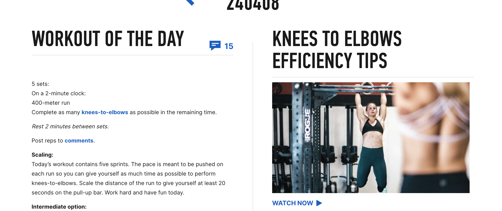
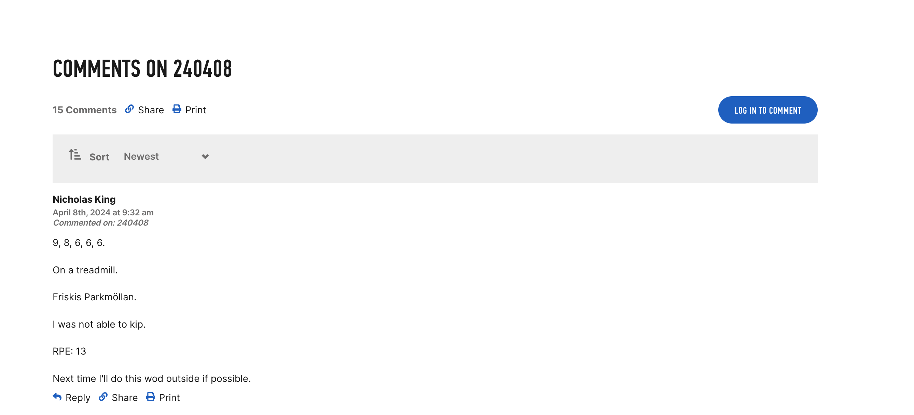
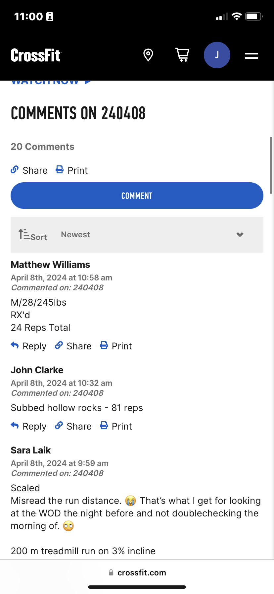

Project Proposal

Project Choice

WOD4U

Project Description

My app is called WOD4U. It's a fitness app for users who want to have a workout displayed for them and have the ability to CRUD. Users will only be able to update, delete and create their own workouts and it will all be added to the preset workout database where all users will have the ability to read the workouts as well as favorite workouts. 

Wire Frames

View 1 https://imgur.com/qoFUGMH

View 2

https://imgur.com/DGG4vAU

Mobile View 1 https://imgur.com/hnAxaut

Mobile View 2 https://imgur.com/IpHfMk9

User Stories

MVP Goals

As a user I want to CRUD
As a user I want to favorite
As a user I want to see all workouts available
As a user I want to have the option to see a random workout
As a user I want a log-in unique to me

Stretch Goals

As a user I want a profile picture
As a user I want to be able to like a workout
As a user I want to be able to comment under workout
As a user I want to be able to track which workout I did on what day

Timeline - Daily Accountability

Monday		

- Create Proposal
- Find suitable Third-party API or create own data
- Have the bones of routes, controllers and models
- MongoDB connecting with data I am going to use
- Server running

Tuesday

- Authentication/Authorization
- Implement backend registration logic, including password hashing
- Set up login verification backend logic with token management
- Design database schema for all entity's
- Implement API endpoint for creating
- Set up database query for fetching

Wednesday

- Implement API endpoint for updating
- Add delete option to UI for each workout
- Set up backend logic for deleting workout
- Deployment

Thursday 

- Frontend to display workouts
- Create UI for editing workout
- Login form UI
- Develop user registration form
- Create a random workout feature that selects a workout at random for the user
- Finalize MVP

Friday 

- Add a like feature for workouts
- UI component and backend to manage likes

Saturday

- Enable users to comment on workouts
- Providers users with ability to log workouts they've completed
- Feature to mark a workout as done and track activities over time
- Neccessary backend logic to bring it together

Sunday

- Animations for liking a workout and completing a workout
