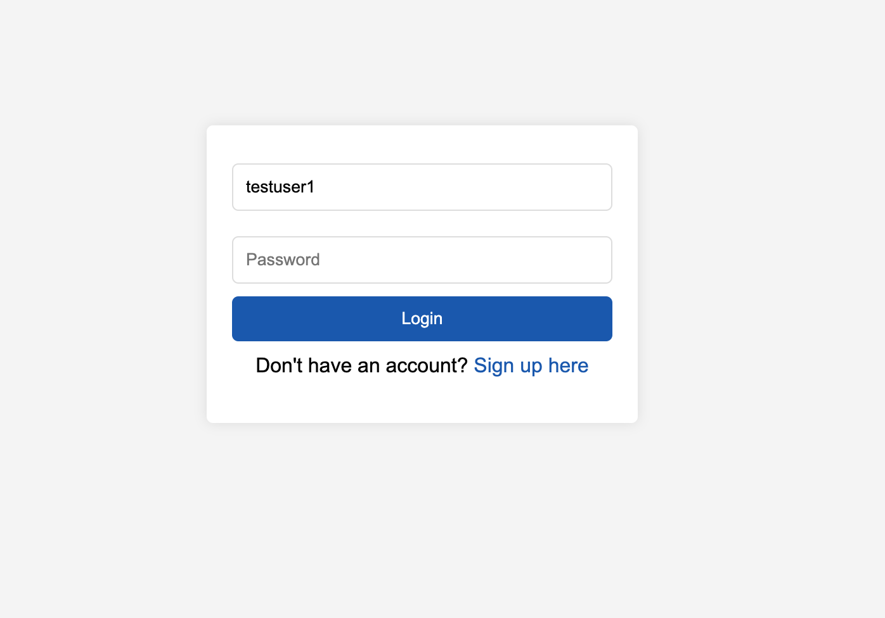
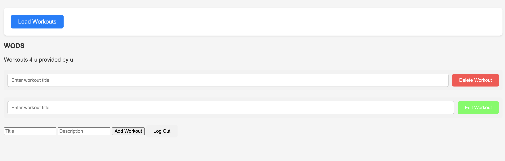

Title

WOD4U

Description

WOD4U is an app where users can get workouts of the day given to them as we all the ability to create, update, and delete their own workouts. Workouts that are created by users will be added to the preset database of workouts that the app comes with and users can only create workouts using the movements already listed in the 30 preset workouts the app comes with.

Wire Frames

View 1 https://imgur.com/9fCW0Rh

View 2

https://imgur.com/F8YKhiM

ERD

User Stories

MVP Goals

As a user I want to CRUD
As a user I want to favorite
As a user I want to see all workouts available
As a user I want a log-in unique to me

Stretch Goals

As a user I want a profile picture
As a user I want to be able to like a workout
As a user I want to be able to comment under workout
As a user I want to be able to track which workout I did on what day

Timeline - Daily Accountability

# Monday

- [x]  Create Proposal
- [x]  Find suitable third-party api or create own data
- [x]  Have the bones of routes, controllers and models

- [x]  Authentication/Authorization

- [x]  MongoDB connecting with data I am going to use
- [x]  Server running

# Tuesday

- [x]  Implement backend registration logic, including password hashing
- [x]  Login form UI
- [x]  Set up login verification backend logic with token management
- [x]  Design database schema for all entity's
- [x]  Implement API endpoint for creating
- [x]  Set up database query for fetching

# Wednesday

- [x]  Frontend to display workouts
- [x]  Create UI for editing workout
- [x]  Implement API endpoint for updating
- [x]  Add delete option to UI for each workout
- [x]  Set up backend logic for deleting workout

# Thursday

- [x]  Develop user registration form
- [ ]  Create a random workout feature that selects a workout at random for the user
- [x]  Finalize MVP

# Friday

- [ ]  Implement Profile Customization
- [ ]  Capability for users to upload and display a profile picture
- [ ]  Add a like feature for workouts
- [ ]  UI component and backend to manage likes

# Saturday

- [ ]  Enable users to comment on workouts
- [ ]  Providers users with ability to log workouts they've completed
- [ ]  Feature to mark a workout as done and track activities over time
- [ ]  Necessary backend logic to bring it together

# Sunday

- [ ]  Animations for liking a workout and completing a workout

