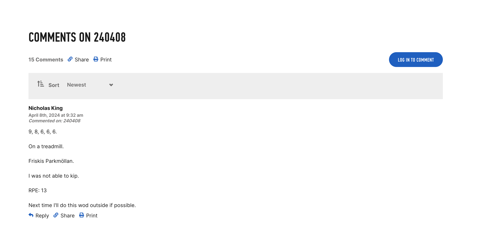
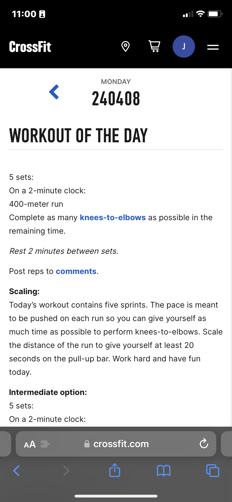
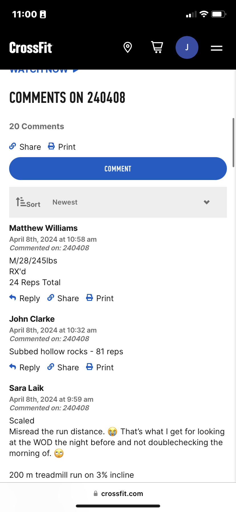

Title

WOD4U

Description

WOD4U is an app where users can get workouts of the day given to them as we all the ability to create, update, and delete their own workouts. Workouts that are created by users will be added to the preset database of workouts that the app comes with and users can only create workouts using the movements already listed in the 30 preset workouts the app comes with.

Wire Frames

View 1 https://imgur.com/qoFUGMH

View 2

https://imgur.com/DGG4vAU

Mobile View 1 https://imgur.com/hnAxaut

Mobile View 2 https://imgur.com/IpHfMk9

User Stories

MVP Goals

As a user I want to CRUD
As a user I want to favorite
As a user I want to see all workouts available
As a user I want to have the option to see a random workout
As a user I want a log-in unique to me

Stretch Goals

As a user I want a profile picture
As a user I want to be able to like a workout
As a user I want to be able to comment under workout
As a user I want to be able to track which workout I did on what day

Timeline - Daily Accountability

Monday		

- Create Proposal
- Find suitable Third-party API or create own

Tuesday

- Have server up and running and connected
- Have the ability to CRUD

Wednesday

- Have the ability of a log-in unique to user avaialble
- MVP Goals completed

Thursday 

- Have the ability to hit complete on a workout
- Have option for a profile pciture
- Have option to like a workout

Friday 

- Have option to comment under workout
- Have option to track which workout I did on what day

Saturday

- Work on front-end 
- Color options

Sunday

- Animations for liking a workout and completeing a workout

